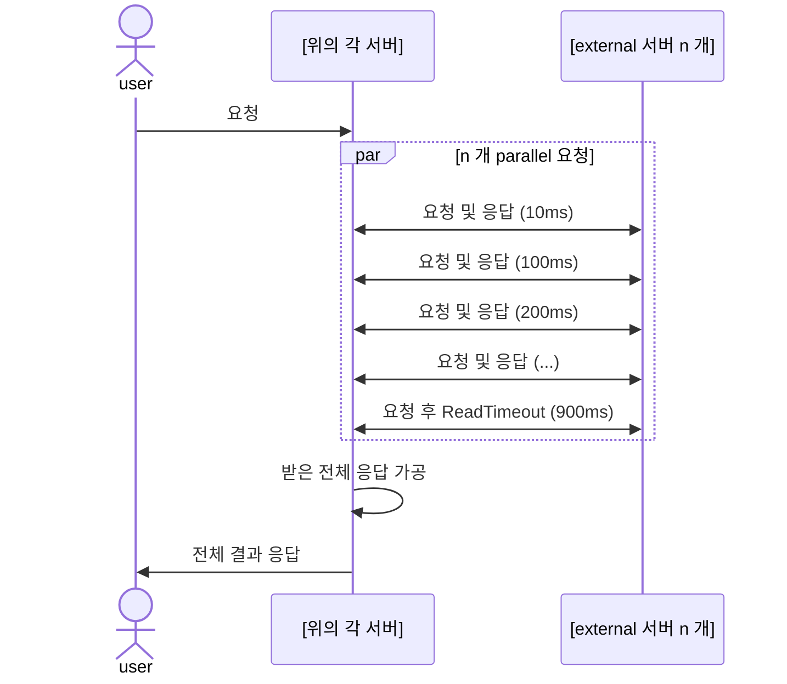

# Server Performance Test
### 아래 서버들의 테스트 진행
* Spring MVC + WebClient
* Spring WebFlux
* Spring + Vert.x
### 외부 요청용 서버
* External : sleep 값을 파라미터로 받아서 sleep 후 응답
### 테스트 Sequence

```mermaid
sequenceDiagram
    actor user
    participant server as [위의 각 서버]
    participant external as [external 서버 n 개]

    user ->> server: 요청
    par n 개 parallel 요청
    server <<->> external: 요청 및 응답 (10ms)
    server <<->> external: 요청 및 응답 (100ms)
    server <<->> external: 요청 및 응답 (200ms)
    server <<->> external: 요청 및 응답 (...)
    server <<->> external: 요청 후 ReadTimeout (900ms)
    end 
    
    server ->> server: 받은 전체 응답 가공
    
    server ->> user: 전체 결과 응답
```