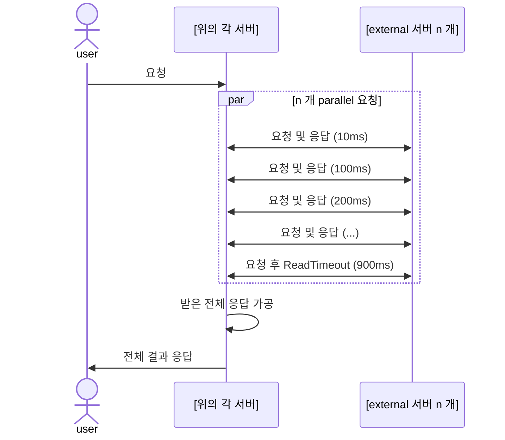

# Server Performance Test
### 아래 서버들의 테스트 진행
* Spring MVC + WebClient
* Spring WebFlux
* Spring + Vert.x
### 외부 요청용 서버
* External : sleep 값을 파라미터로 받아서 sleep 후 응답
### 테스트 Sequence


### Build (Jib)
* Docker 이미지 빌드 명령어
  * 이 프로젝트에서 각 서브모듈에 대해 Docker 이미지를 빌드하려면 다음 명령어들을 실행하세요.
* 명령어들
  * 각 서브모듈에 대해 Docker 이미지를 빌드하는 명령어는 다음과 같습니다:
```bash
# external 서브모듈에 대해 Docker 이미지 빌드
./gradlew -x clean :application:external:jibDockerBuild

# spring-mvc-resttemplate
./gradlew -x clean :application:spring-mvc-resttemplate:jibDockerBuild

# spring-mvc-webclient 서브모듈에 대해 Docker 이미지 빌드
./gradlew -x clean :application:spring-mvc-webclient:jibDockerBuild

# spring-webflux 서브모듈에 대해 Docker 이미지 빌드
./gradlew -x clean :application:spring-webflux:jibDockerBuild

# vertx 서브모듈에 대해 Docker 이미지 빌드
./gradlew -x clean :application:vertx:jibDockerBuild
```

### docker-compose.yml
```bash
docker compose up -d
```